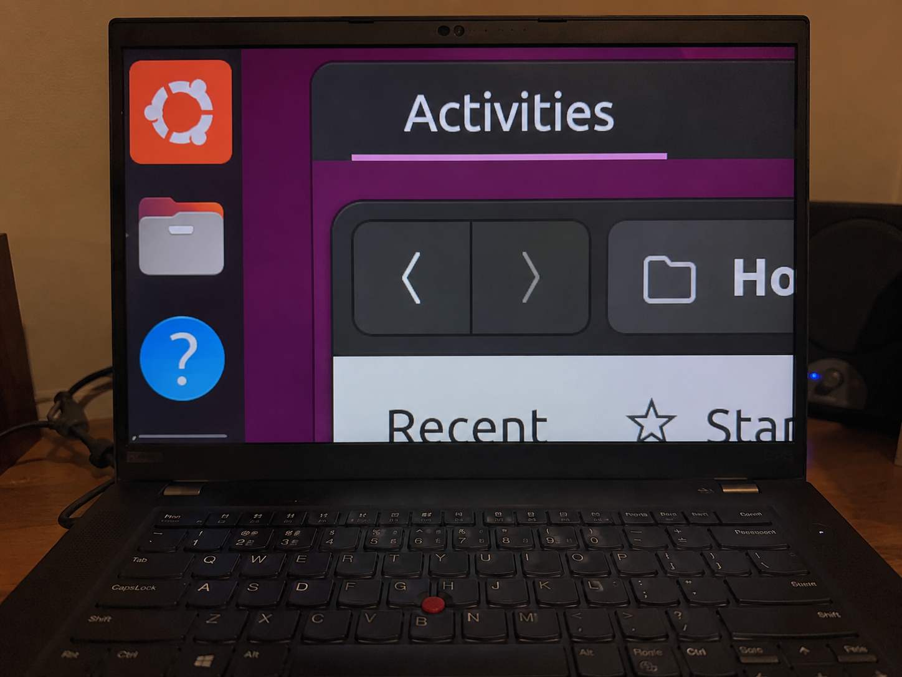

+++
title = "Fixing Web hover behaviors for magnifier users"
description = "Client-side fixes for inaccessible interaction patterns."
date = "2026-05-24"

[taxonomies]
tags = ["accessibility", "magnifier"]
+++

### The problem

Modern websites love using hover effects. Pausing the mouse somewhere inevitably causes something to pop up, whether that be a preview card, a floating menu, or something else.

For most users, this is fine and sometimes even helpful. If it's unwanted, the user can just move the mouse elsewhere. But it poses an accessibility challenge for full-screen magnification users. Their visible area of the page, known as a viewport, will be much smaller than what most other users have.

Many hover-heavy interfaces are built around a pair of assumptions:

* Moving the mouse over something means the user wants to interact with it more deeply.
* Users can comfortably look at one part of the screen while manipulating another.

For full-screen magnification users, neither assumption really holds. Moving the mouse is often just a way to pan the viewport or keep content visible, not an intentional request for more UI. And because only a small portion of the screen is visible at once, users frequently cannot see the area they are interacting with and the area where the resulting information appears at the same time.

#### Obscured content

At high zoom levels, the visible portion of the screen is tiny, and the magnified area usually follows the mouse pointer. So when a website decides to reveal extra information on hover, that information can end up covering the very thing the user was trying to look at.

The obvious solution, moving the mouse elsewhere, doesn't really work. Moving the pointer also moves the zoomed viewport, which can push the content completely off-screen.

#### Important information outside the zoomed viewport

In some cases, the problem is spatial rather than transient. An interactive graph, for example, might show numerical values in a fixed corner of the screen while the user moves the mouse across the graph. Under full-screen magnification, the user may be able to see the graph or the readout, but not both at the same time. Moving the mouse to explore the graph also moves the zoomed viewport, making it difficult or impossible to keep the changing values visible.

<video width="100%" controls>
  <source src="graph-values-offscreen.mp4" type="video/mp4">
  Your browser does not support the video tag.
</video>

The root problem is that, for magnification users, mouse movement is doing two completely different jobs at the same time. It's being used both to indicate what they want to interact with, and to control which part of the screen they can see.

### The solution

Fortunately, these problems don't require changes to every offending site. We can introduce some small tweaks on the user side to decouple pointer interaction from panning the viewport.

In macOS, this kind of functionality is built-in. One of the ["advanced options" of the full-screen magnifier](https://support.apple.com/guide/mac-help/change-zoom-advanced-options-accessibility-mh35715/26/mac/26) is "Detach zoom view from pointer." When the user holds down the Control and Command keys, the mouse pointer is effectively frozen in place. Moving the mouse moves the zoomed area, but the focused application doesn't register any mouse movement.

#### Freezing the pointer

With some AI assistance, I've replicated this as a ["freeze pointer" user script](https://github.com/steinbro/gnome-low-vis-config/blob/main/userscripts/A11yFreezePointerOnCtrl.js), which can be installed in a Web browser through an extension like [Tampermonkey](https://www.tampermonkey.net/).

Below, as illustrated earlier, the user is moving the mouse across a graph while the exact values appear in a fixed location outside the magnified area. With the frozen-pointer userscript, however, the user can hold down the Control key to temporarily freeze the hover position on a single data point. This enables them to pan the magnified viewport until the readout is visible again, without changing which data point is selected under the mouse pointer.

<video width="100%" controls>
  <source src="freeze-pointer-demo.mp4" type="video/mp4">
  Your browser does not support the video tag.
</video>

#### Shielding the page from interaction

I also created a second user script that [temporarily adds an "invisible wall" between the pointer and the web page](https://github.com/steinbro/gnome-low-vis-config/blob/main/userscripts/A11yDisableHoverOnCtrl.js). This takes a more aggressive, but also more reliable, approach: instead of freezing the current hover state in place, it prevents the page from receiving pointer interactions altogether while the modifier key is held. The downside is that it disables hover behavior entirely rather than preserving the currently displayed item or tooltip, so it's less helpful in cases like the interactive graph.
