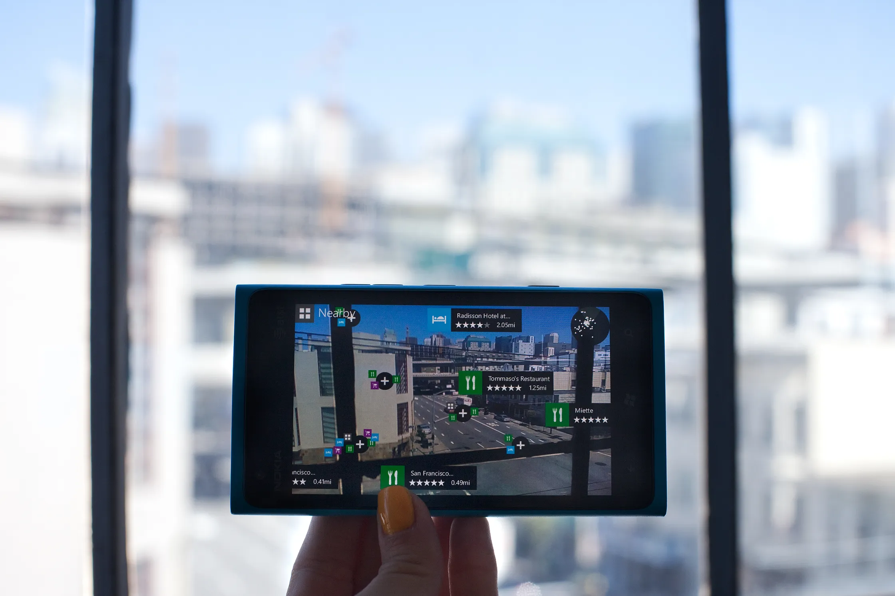

+++
title = "Audio annotations for the real world"
description = "Gaining a superhuman sense of space through sound."
date = "2026-06-19"

[taxonomies]
tags = ["accessibility", "text-to-speech"]
+++

### Augmenting reality with standard maps

Cartography dates back to a time when the most efficient way to describe a place was to draw it on paper. In more recent years, we've had the ability to layer map information on top of the real world, thanks to our smartphones. Your phone knows what's around you because it knows your exact GPS location together with information about all nearby venues, at least those that have been captured in online maps.

I remember this idea showing up as a feature on Windows Phone over a decade ago, through an app called Nokia City Lens. You could hold up your phone to a city street, and it would add floating labels on top of all the places it knew about.

(source: [WIRED](https://www.wired.com/2012/05/hands-on-nokia-city-lens-beta-augmented-reality-for-your-lumia-phone/))

Less well-publicized was a Microsoft research project called Soundscape, which  did this reality augmentation as audio rather than video. Instead of drawing labels on top of a camera view, your phone speaks markers as spatial audio. Even with basic headphones, you hear the labels as if they emanate from different places and directions.

This turns out to be a pretty handy navigational aid, especially if you can't easily read signs. Walking down the street with earbuds in and phone in your pocket, you hear the names of places around you as you approach them, with a decent sense of exactly where they are.

{{ youtube(id="v5DXykmOdJ8") }}

### Community-driven mobility tools

Nifty as this technology is, there wasn't much commercial potential, and [Microsoft discontinued Soundscape](https://www.microsoft.com/en-us/research/blog/microsoft-soundscape-new-horizons-with-a-community-driven-approach/) in 2023. To satisfy the dedicated fanbase among low-vision users, they first [dumped the source code](https://github.com/microsoft/soundscape) on GitHub, under an open-source license. After some initial concern as to whether anyone would step up to run the servers and republish the app, no fewer than three different groups picked it up. Each has found their own niche to serve.

A solo developer published [VoiceVista](https://apps.apple.com/us/app/voicevista/id6450388413), a closed-source fork that adds all sorts of bells and whistles, like a "breadcrumb" mode. Separately, a Scottish nonprofit published a long-requested [Android version](https://play.google.com/store/apps/details?id=org.scottishtecharmy.soundscape&hl=en_US), which was no small feat. And finally, there is [Soundscape Community](https://soundscape.services/), the initiative I helped get off the ground and spent several years as a volunteer developer. They've established an open source community of contributors and users, and have been finding new uses and collaborations in adaptive sports, among others

### What makes Soundscape special

It's hard to pinpoint what makes the Soundscape app feel so empowering, compared to audio turn-by-turn directions that are commonplace. Perhaps it's the strong sense of agency: Soundscape is not telling you where to go -- you follow whatever path you want, and it dutifully speaks up about what's around you, when it's most relevant.

Soundscape is also unusual assistive tech because it's providing a visual aid without using any visual input. It relies entirely on GPS position and compass heading, not the camera. This makes it feel a bit like a spatial superpower. It can tell you the name of a park that has no marker, or the name of a street that has no sign. This makes it a natural complement to smart glasses that can describe a visual scene.
