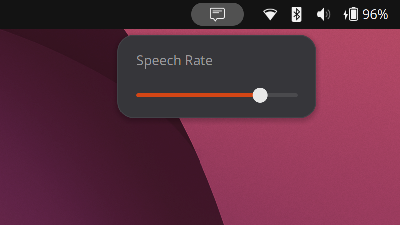

+++
title = "An unobtrusive text-to-speech workflow in GNOME"
description = "Speak selected text, improved with Speech Dispatcher."
date = "2026-06-06"

[taxonomies]
tags = ["accessibility", "text-to-speech"]
+++

For every blind user who can't see their computer screen at all, there are many more low-vision users with some usable vision but not enough to read text on the screen comfortably. Users like this could benefit greatly from using more speech, but it's hard to recommend adopting a full-fledged screen reader. These tools can feel like too much for a user with significant remaining vision. Even beyond the massive set of keyboard shortcuts to learn, many applications are not optimized for assistive tech and can become even harder to navigate. No matter how masterful the user's command of their screen reader, they might conclude they're better off just relying on magnification and their remaining vision .

When text-to-speech is not a convenience but a necessity, it needs to be available instantly, for any text on the screen. The operating system, or more specifically the desktop environment, can step in to provide it system-wide, across all applications. For Linux, this functionality (as with much else on Linux) is possible with some tinkering.

### On-demand speech on other operating systems

macOS has had ["Speak Selection" functionality](https://support.apple.com/en-ca/guide/mac-help/mh27448/mac) for ages. When actively speaking, the system shows a floating controller for playback and speech rate adjustment.

Microsoft similarly introduced [speech features into Magnifier](https://blogs.windows.com/windowsexperience/2020/05/21/whats-coming-in-windows-10-accessibility/) in Windows 10. Clicking the "Read from here" button starts reading text aloud from wherever the user specifies.

The [Reader View in Firefox](https://support.mozilla.org/en-US/kb/firefox-reader-view-clutter-free-web-pages) has text-to-speech built in as well.

Screen readers also have some features that are geared towards partially-sighted users. Both NVDA on Windows and VoiceOver on macOS support a mode that reads text under the mouse pointer. But on Linux, [Orca's Mouse Review feature works inconsistently under Wayland](https://discourse.gnome.org/t/mouse-review-is-hit-and-miss/34949) the modern display system for Linux.

### Prior art

A [2021 blog post](https://dev.to/tylerlwsmith/read-selected-text-out-loud-on-ubuntu-linux-45lj) demonstrates how to set up a keyboard shortcut to trigger text-to-speech using an impressively short shell script. The script simply grabs the highlighted text from the clipboard's primary selection buffer, and feeds that directly into the espeak synthesizer.

This works great much of the time, but you'll run into many unhandled edge cases if you use it extensively. For example. text containing Unicode mathematical characters, a common social media trick for adding styling, can turn into a stream of arcane code point names. "𝐉𝐚𝐯𝐚𝐒𝐜𝐫𝐢𝐩𝐭" becomes "letter 1D409, letter 1D41A, ..." Emoji fare even worse, often disappearing entirely from the spoken output.

My favorite failure mode is when the script encounters text surrounded by double square brackets. The espeak synthesizer interprets what's inside as raw phonetic data. The result is text that is a very exotic flavor of garbled. [[ If you happen to be using it now, this example will demonstrate exactly what I  mean,. ]]

### A native extension for GNOME

I've published a [GNOME shell extension](https://extensions.gnome.org/extension/9659/speak-selection/) that builds on the same basic approach to capturing and speaking selected text, but makes it a bit more robust to text encountered in the wild.

The most visible improvement is its integration with the GNOME desktop, but the bigger change comes from inserting Speech Dispatcher between your text and the speech engine. This long-standing Linux service handles many of the failure modes we encountered earlier: it translates Unicode characters into something meaningful, announces emoji names instead of silently dropping them, and filters out control sequences that can trip up speech synthesizers.

Because Speech Dispatcher operates as a system-wide service, it also improves the overall listening experience. Other applications won't try to speak over the extension, and you can change your preferred voice or speaking rate without needing to edit the values hard-coded into the original script.

There are still some limitations. Most significantly, the extension still relies on the primary selection buffer, a legacy feature of the Linux desktop that isn't supported universally. For example, applications that are based on the Flutter toolkit, including the Ubuntu App Center and FluffyChat, [don't populate this buffer](https://github.com/flutter/flutter/issues/180231) when the user highlights text. That means the extension will ignore what you've highlighted in your Flutter-based app, and instead speak the last text highlighted in some other non-Flutter-based application.

Nevertheless, give it a try and let me know if you find it helpful!